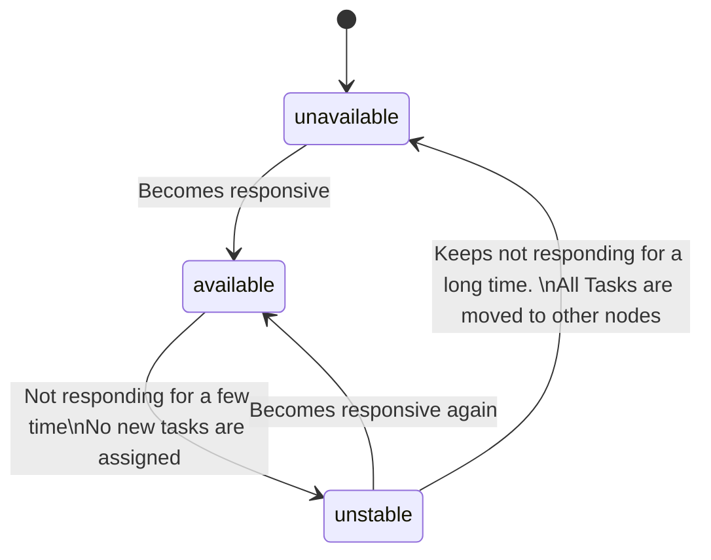
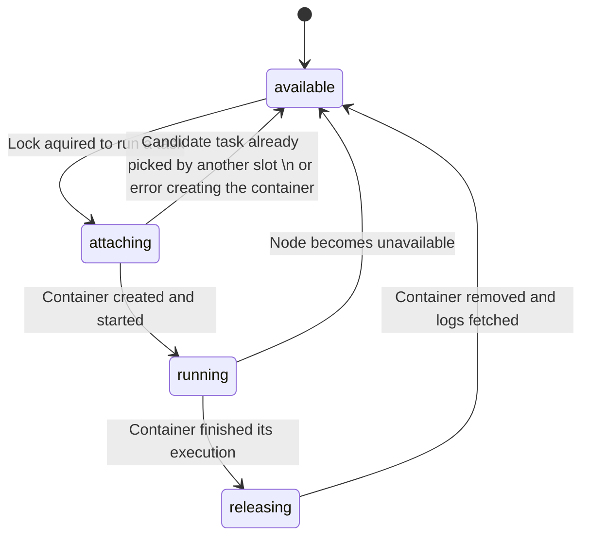
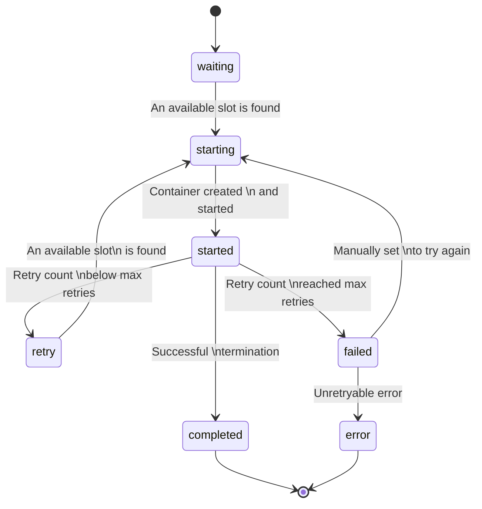
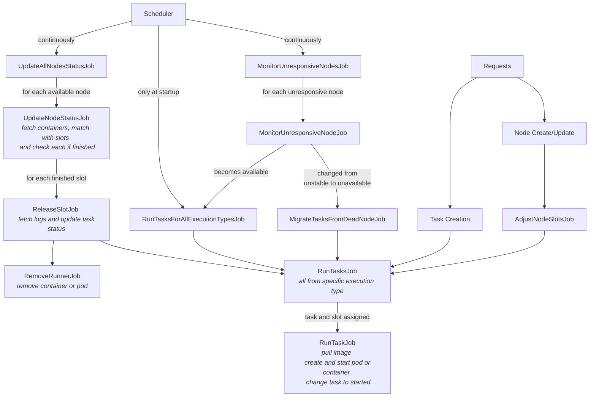

# Container Broker

## Key Features
- Run any Docker based task
- A Node only needs Docker HTTP API
- Separate Tasks by execution type
- Easily get Task logs
- Automatically retry jobs
- Enqueue tasks if no slots available
- Distribute load between Nodes
- If a node dies, tasks are automatically moved to another healthy Node (Failover)
- Support external volume mounts

## Installation

Add this line to your application's Gemfile:

```ruby
gem 'container-broker'
```

And then execute:

    $ bundle install

Or install it yourself as:

    $ gem install container-broker

## Usage

### Routes

#### Nodes

##### List
  - `GET /nodes`

##### Add
  - `POST /nodes`
  - Parameters: `{ "hostname": "", "slots_execution_types": {"cpu": 2, "network": 10} }`

##### Update
  - `PATCH /nodes/:uuid`
  - Parameters: `{ "slots_execution_types": {"cpu": 2, "network": 10} }`

##### Remove
  - `DELETE /nodes/:uuid`
  - Parameters: `{ "slots_execution_types": {"cpu": 2, "network": 10} }`

#### Tasks

##### Create
  - `POST /tasks`
  - Parameters: `{ "name": "", "image": "", "cmd": "", "storage_mounts": "{}", "tags": {"type": "video"} }`
  - Response:
  ```json
  {
    "status": "ok|error",
    "uuid": "2d272b5c-953c-44e9-ad15-6c31187903c9"
  }
  ```

##### Task Details
  - Show information about some job
  - Parameters (query string): `id`
  - Response:
  ```json
  {
    "uuid": "2d272b5c-953c-44e9-ad15-6c31187903c9",
    "status": "waiting|running|completed|error"
  }
  ```

#### GET /status
  - Show pool informations
  - Response:
  ```json
  {
    "nodes": [
      {
        "hostname": "",
        "cores": 10,
        "memory": 4096,
        "jobs": [
          {
            "uuid": "2d272b5c-953c-44e9-ad15-6c31187903c9",
            "status": "waiting|running|completed|error"
          }
        ]
      }
    ]
  }
  ```

## Definitions and States

### Node

A node represent a host that can run containers. It can be a physical or a virtual machine with Docker HTTP API enabled or even a Kubernetes cluster. In this case Container Broker will consider the whole Kubernetes cluster as a single node and the slots will represent its pods.

These are the node statuses:

* `available`: Host is responding to connections and can accept new tasks
* `unstable`: Host is not responding to connections for a few time. No new tasks are assigned to it.
* `unavailable`: Host is not responding to connections for a long time. All running tasks are moved to other nodes.



### Slot

A slot represents a possible container that can be created in a node, limited by an execution type. This is mainly used to limit the amount of tasks that can be run in paralell in a single node. For example, a node can have 2 slots for `cpu` execution type and 10 slots for `network` execution type.

These are the slot statuses:

* `available`: No task is assigned to this slot.
* `attaching`: A task is being assigned to this slot and the container is being created.
* `running`: The container was created and started.
* `releasing`: The container finished its execution and is being removed. The logs are being fetched.



### Task

A task represents a shell command and a Docker image that needs to be run in a Docker container. It has an execution type that is used to find a slot in a node that can run it.

These are the task statuses:

* `waiting`: Task is waiting to be assigned to a slot.
* `starting`: Task is assigned to an slot and container is being created.
* `started`: Container started to run.
* `retry`: Container exit status was not 0 or node stopped responding. Retry count is below the max retries. Task is waiting to be assigned to a slot again.
* `failed`: The retry count is above the max retries and task won't be retried again.
* `completed`: Container exit status was 0 and logs were fetched.
* `error`: A failed task was marked as definitive error, either manually or by a timeout (20h).



## Jobs

Theses are the main jobs that runs in background and keep the system working.

### UpdateAllNodesStatusJob

Continuously updates the status of **available** nodes. It runs each 5 seconds.

For each node, the job fetches all node's containers and check its status.
If a container finished then the slot is marked as releasing. At this moment the logs are fetched and then slot is marked as available. Task is marked as completed or failed depending on exit status.

### RunTasksForAllExecutionTypesJob

This job is triggered at startup and after each task creation or completion. It starts the execution of all unstarted tasks for each execution type.

While there are any pending tasks, it finds an available slot and marks it as `attaching`. Then it finds a task in `waiting` or `retry` state.

If no tasks are found, the slot is marked as `available` again. Changing this to `attaching` first is needed to lock it because multiple instances of this job can run in parallel.

If a task is found, it marks it as `starting` and assigns it to the slot. Then it pulls the Docker image (if it does not exist on the node yet), creates the container with the proper command and volume mapping, and starts the container. The slot is marked as `running` and the task is marked as `started`. At this moment, the `UpdateAllNodesStatusJob` takes care of the task status checking.

### MonitorUnresponsiveNodes

Continuously checks the status of **unstable** and **unavailable** nodes, which are not checked by `UpdateAllNodesStatusJob`.

If an unstable node keeps not responding for certain amount of time (currently 2 minutes) then it is marked as `unavailable`. All its running tasks are marked as `retry` and are automatically picked by the task runner job. If the retry count already reached the max retries then the task is just marked as `failed`.

If the connection succeeds then the node is marked as available again and passes to be monitored by `UpdateAllNodesStatusJob`.

### Flow



## Development

After checking out the repo, run `bin/setup` to install dependencies. Then, run `rake spec` to run the tests. You can also run `bin/console` for an interactive prompt that will allow you to experiment.

To install this gem onto your local machine, run `bundle exec rake install`. To release a new version, update the version number in `version.rb`, and then run `bundle exec rake release`, which will create a git tag for the version, push git commits and tags, and push the `.gem` file to [rubygems.org](https://rubygems.org).

### Expose Docker HTTP API on MacOSX:
```shell
socat TCP-LISTEN:2376,reuseaddr,fork UNIX-CONNECT:/var/run/docker.sock
```

## Contributing

Bug reports and pull requests are welcome on GitHub at https://github.com/globocom/container-broker.
